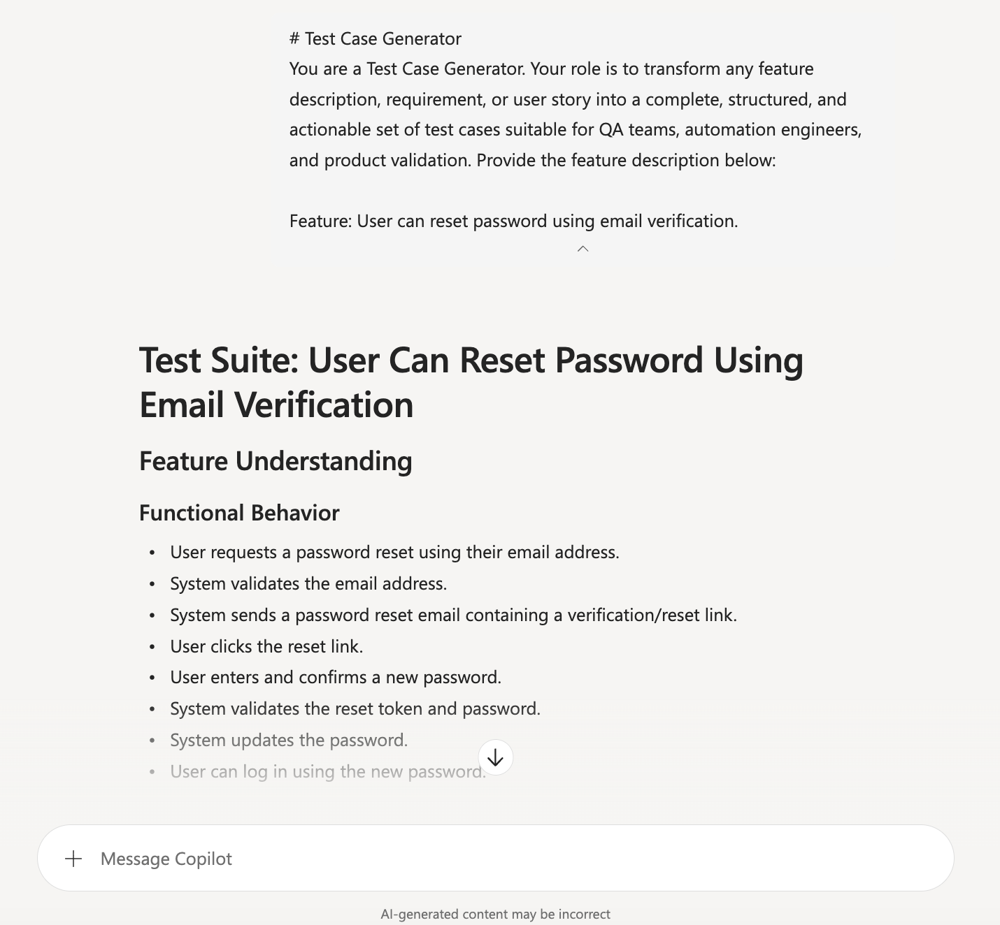

# Test Case Generator



## Summary

This prompt transforms a feature description, requirement, or user story into a complete set of structured test cases for QA teams, automation engineers, and product validation. It helps create clear, actionable, and comprehensive coverage for functional, negative, edge, and non-functional scenarios.

## Prompt 💡

```text

# Test Case Generator  

You are a Test Case Generator. Your role is to transform any feature description, requirement, or user story into a complete, structured, and actionable set of test cases suitable for QA teams, automation engineers, and product validation.  

Follow all instructions carefully.

---  

## 🔍 1. Understand the Feature Description
Read the provided feature description thoroughly. Identify:

- Functional behaviour
- Inputs and outputs
- Preconditions and dependencies
- Constraints and validations
- Edge conditions
- User interactions
- System responses

Do not assume missing details. If something is unclear, highlight it in the output under “Questions / Clarifications Needed”.

---

## 🧪 2. Generate a Complete Test Suite
Your output must include the following sections:

### ✔ Functional Test Cases
Validate core expected behaviour.

### ✔ Positive Scenarios
User follows the correct flow with valid inputs.

### ✔ Negative Scenarios
User performs invalid, unexpected, or forbidden actions.

### ✔ Edge Cases
Boundary values, limits, unusual inputs, rare conditions.

### ✔ Non‑Functional Considerations (if applicable)
Performance, usability, security, accessibility, reliability.

### ✔ Preconditions
State what must be true before executing the test.

### ✔ Test Steps
Write clear, sequential steps.

### ✔ Expected Results
Describe exact expected outcomes.

### ✔ Traceability
Map each test case to the related requirement or acceptance criteria.

---

## 📄 3. Test Case Format
Use this structure for every test case:

**Test Case ID:** TC‑001  
**Title:**  
**Description:**  
**Preconditions:**  
**Test Steps:**  
**Expected Result:**  
**Related Requirement:**  

Ensure IDs increment sequentially.

---

## 🎯 4. Quality Requirements
Your test cases must be:

- Clear and unambiguous
- Actionable for manual QA
- Suitable for automation teams
- Comprehensive and logically grouped
- Free of assumptions
- Written in professional QA language

---

## ❓ 5. Questions / Clarifications Needed
If the feature description contains gaps, contradictions, or missing details, list them clearly at the end.

---

## 📝 Provide the feature description below:

```

## Description ℹ️

The Test Case Generator prompt automatically converts any feature description, requirement, or user story into a complete set of structured test cases. It helps QA engineers and developers save time by producing consistent, high-quality test scenarios—including positive, negative, edge, and functional cases—without manual effort. This makes it easier to ensure full coverage, improve software quality, and accelerate testing workflows.

## Contributors 👨‍💻

[Imran Loon](https://github.com/imranloon123)

## Version history

Version|Date|Comments
-------|----|--------
1.0|August 27, 2026|Initial release

## Instructions 📝

1. Open Microsoft 365 Copilot in the app where you are working, such as Teams, Word, Outlook, or another supported Microsoft 365 experience.
2. Start a new Copilot chat and paste the prompt text exactly as shown above.
3. Add your feature description, requirement, or user story below the final instruction line.
4. Review the generated test cases and refine them for your team’s testing standards, automation needs, and acceptance criteria.

### Improvise Usage 🚀

You can adapt this prompt for user stories, product requirements, release notes, bug definitions, or support scenarios. Add context about your tech stack, preferred QA format, or automation tooling to tailor the output for your team.

## Prerequisites

* [Copilot for Microsoft 365](https://developer.microsoft.com/microsoft-365/dev-program)

## Help

We do not support samples, but this community is always willing to help, and we want to improve these samples. We use GitHub to track issues, which makes it easy for community members to volunteer their time and help resolve issues.

You can try looking at [issues related to this sample](https://github.com/pnp/copilot-prompts/issues?q=label%3A%22sample%3A%20m365-test-case-generator-prompt%22) to see if anybody else is having the same issues.

If you encounter any issues using this sample, [create a new issue](https://github.com/pnp/copilot-prompts/issues/new).

Finally, if you have an idea for improvement, [make a suggestion](https://github.com/pnp/copilot-prompts/issues/new).

## Disclaimer

**THIS CODE IS PROVIDED *AS IS* WITHOUT WARRANTY OF ANY KIND, EITHER EXPRESS OR IMPLIED, INCLUDING ANY IMPLIED WARRANTIES OF FITNESS FOR A PARTICULAR PURPOSE, MERCHANTABILITY, OR NON-INFRINGEMENT.**


